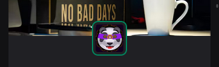
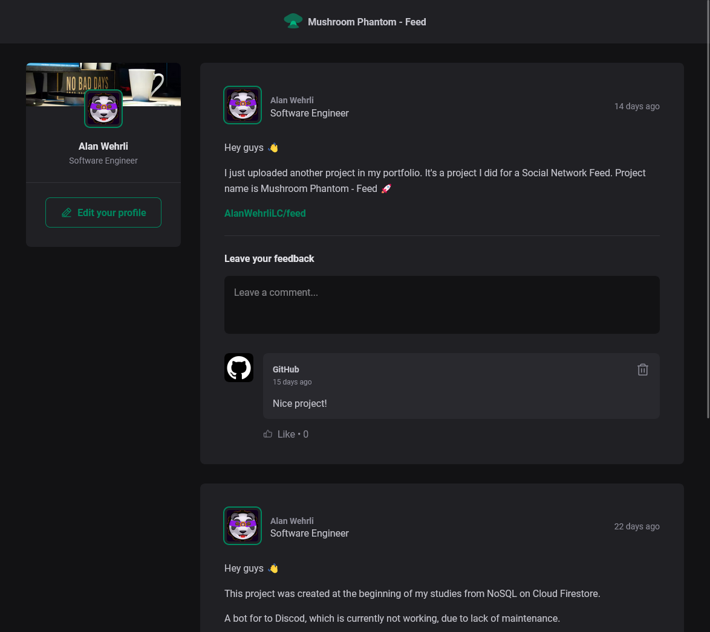
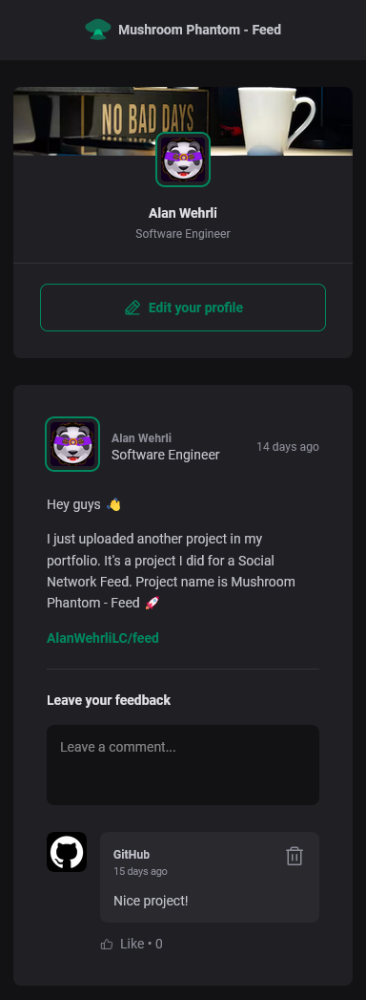

<p align="center">
  
</p>

<h1 align="center">Feed</h1>
<p align="center">Feed from a social network</p>

<h3 align="center">

  <a href="./LICENSE" target="_blank">
    
  </a>

</h3>

<br />

<br />

<p align="center">
    
    
</p>

<br />

# Techs

-  React
-  CSS
-  Vite
-  Typescript
-  Phosphor React


## Installation of dependencies and local use

> Create somewhere on your pc, a folder to create a copy of the repository, inside it open command terminal and type the commands below:
```
git clone https://github.com/AlanWehrliLC/feed.git
cd feed
npm install
npm run dev
```
